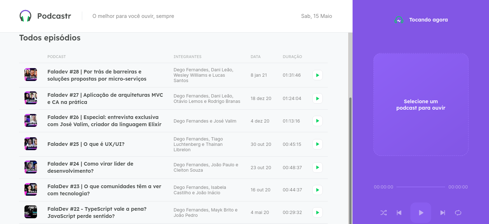
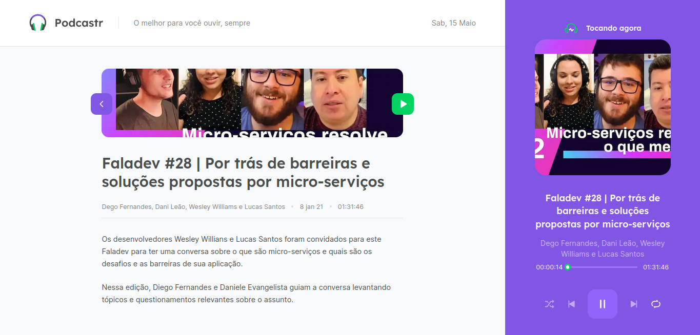

<p align="center">
   
   <a href="https://github.com/tgmarinho/README-ecoleta/stargazers"></p>

<h1 align="center">
Podcastr
</h1>

<p align="center">
 <a href="#-sobre-o-projeto">Sobre</a> •
 <a href="#-layout">Layout</a> • 
 <a href="#-como-executar-o-projeto">Como executar</a> • 
 <a href="#-tecnologias">Tecnologias</a> • 
 <a href="#-autor">Autor</a> • 
 <a href="#user-content--licença">Licença</a>
</p>


## 💻 Sobre o projeto

O Podcastr - É um website gerado estatísticamente que cria uma página que reúne os seus podcasts e o melhores podcasts que se tem no momento com assuntos diversos e principalmente do mundo da tecnologia.

Projeto desenvolvido durante a **NLW - Next Level Week** oferecida pela [Rocketseat](https://blog.rocketseat.com.br/primeira-next-level-week/).


---

## 🎨 Layout

### Web

<p align="center" style="display: flex; align-items: flex-start; justify-content: center;">
  
  <hr>
  <p align="center" style="display: flex; align-items: flex-start; justify-content: center;">
  
</p>

---

## 🚀 Como executar o projeto

Este projeto é divido em duas partes:
1. Backend (mock Api) 
2. Frontend (pasta src)

💡O Frontend precisa que o Backend esteja sendo executado para funcionar.

### Pré-requisitos

Antes de começar, você vai precisar ter instalado em sua máquina as seguintes ferramentas:
[Git](https://git-scm.com), [Node.js](https://nodejs.org/en/). 
Além disto é bom ter um editor para trabalhar com o código como [VSCode](https://code.visualstudio.com/)
#### 🧭 Rodando a aplicação web

```bash

# Clone este repositório
$ git clone https://github.com/paulocod/Chat-nlw5.git

# Acesse a pasta do projeto no seu terminal/cmd
$ cd pasta

# Instale as dependências
$ (npm) npm install 
$ (yarn) yarn

# Inicie o backend da aplicação
$ (npm) npm run server
$ (yarn) yarn server

# Execute a aplicação em modo de desenvolvimento
$ (npm) npm run dev
$ (yarn) yarn dev

# A aplicação será aberta na porta:3000 - acesse http://localhost:3000

```

---

## 🛠 Tecnologias

As seguintes ferramentas foram usadas na construção do projeto:

#### **Website**   [TypeScript](https://www.typescriptlang.org/)

-   **[Reactjs](https://pt-br.reactjs.org/)**
-   **[Axios](https://github.com/axios/axios)**
-   **[date-fns](https://date-fns.org/)**
-   **[Next](https://nextjs.org/)**
-   **[Sass](https://sass-lang.com/)**

#### **Server**  ([NodeJS](https://nodejs.org/en/)  +  [TypeScript](https://www.typescriptlang.org/))

-   **[json-server](https://www.npmjs.com/package/json-server)**
-   **[NodeJS](https://nodejs.org/en/)**
---

## 👨‍💻 Contribuidores

💜 Um super thanks 👏 para essa galera que fez esse produto sair do campo da ideia.

---

## 💪 Como contribuir para o projeto

1. Faça um **fork** do projeto.
2. Crie uma nova branch com as suas alterações: `git checkout -b my-feature`
3. Salve as alterações e crie uma mensagem de commit contando o que você fez: `git commit -m "feature: My new feature"`
4. Envie as suas alterações: `git push origin my-feature`

---

## 🦸 Autor
 
 <br />
 <b>Paulo Campos🚀</b>
 <br />

[](https://www.linkedin.com/in/paulovcampos/)

---

## 📝 Licença

Este projeto esta sobe a licença [MIT](./LICENSE).

Feito com ❤️ por Paulo Campos 👋🏽 [Entre em contato!](https://www.linkedin.com/in/paulovcampos/)

---